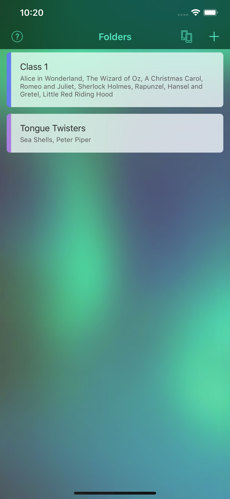

# Transformation Sentences 2  &nbsp;&nbsp;&nbsp; [](https://itunes.apple.com/us/app/transformation-sentences-2/id1439010734?mt=8)


    

This app was originally developed for some teachers in Canberra, Australia to use in their classroom, where they helped develop the English skills of secondary school aged students who were new to the language.

It was created when I finished university and as such is probably the worst code I've ever written. It was using an ancient version of Cocos2D and had such a spaghetti architecture that I declared it unmaintainable.

However, with iOS 11 it became incompatible with the 64-bit-only architecture, and I was receiving some emails from teachers who were no longer able to use the app in their classrooms.

This project is a Swift 4, native UIKit rewrite, that should allow updates to be made easily.

## Author
Bryan Hathaway

[](https://twitter.com/bryparsons)


## License

```
MIT License

Copyright (c) 2018 Bryan Hathaway

Permission is hereby granted, free of charge, to any person obtaining a copy
of this software and associated documentation files (the "Software"), to deal
in the Software without restriction, including without limitation the rights
to use, copy, modify, merge, publish, distribute, sublicense, and/or sell
copies of the Software, and to permit persons to whom the Software is
furnished to do so, subject to the following conditions:

The above copyright notice and this permission notice shall be included in all
copies or substantial portions of the Software.

THE SOFTWARE IS PROVIDED "AS IS", WITHOUT WARRANTY OF ANY KIND, EXPRESS OR
IMPLIED, INCLUDING BUT NOT LIMITED TO THE WARRANTIES OF MERCHANTABILITY,
FITNESS FOR A PARTICULAR PURPOSE AND NONINFRINGEMENT. IN NO EVENT SHALL THE
AUTHORS OR COPYRIGHT HOLDERS BE LIABLE FOR ANY CLAIM, DAMAGES OR OTHER
LIABILITY, WHETHER IN AN ACTION OF CONTRACT, TORT OR OTHERWISE, ARISING FROM,
OUT OF OR IN CONNECTION WITH THE SOFTWARE OR THE USE OR OTHER DEALINGS IN THE
SOFTWARE.
```
